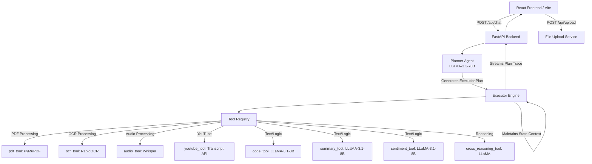

# OmniAgent 

OmniAgent is a full-stack, multi-modal AI agent that can ingest almost anything you throw at it—text, images, PDFs, audio files, and even YouTube URLs. You can upload multiple files at once, and the agent will figure out exactly what you want, extract the content, and chain the right tools together to give you the answer.

## How it Works under the Hood

## Cool Things it Can Do

1. **Juggles Multiple Inputs**: You can upload an audio file and a PDF at the same time, and it will process both.
2. **Smart Planning**: The Planner agent dynamically figures out which tools to use without any human intervention.
3. **No Guessing**: If your prompt is too vague, the agent stops and asks you to clarify instead of hallucinating.
4. **Cross-Referencing**: If you upload a PDF that has a YouTube link inside it, the agent is smart enough to extract the text, find the link, and fetch the video transcript automatically!
5. **Traceable UI**: The frontend includes a sidebar so you can see exactly which tools the agent decided to use and how fast they ran.

## Live Demo
Check out the live deployment here: **[https://omniagent-ui.onrender.com](https://omniagent-ui.onrender.com)**

*(Note: The backend is hosted on a free tier, so it might take 30-50 seconds to spin up on your first request!)*

## Design Choices I Made
- **LLM Orchestration**: I used Groq because it's blisteringly fast. LLaMA-3.3-70B acts as the brain (the Planner), while the smaller LLaMA-3.1-8B models act as the workers inside the individual tools.
- **The Context Engine**: Instead of hardcoding data flows, the `Executor` acts like a shared whiteboard. Tools can read what they need from it and write their outputs back to it so the next tool can pick it up.
- **Safety Nets**: If the Planner messes up or skips a tool, the reasoning tools have fallback mechanisms to try and salvage the request anyway!
